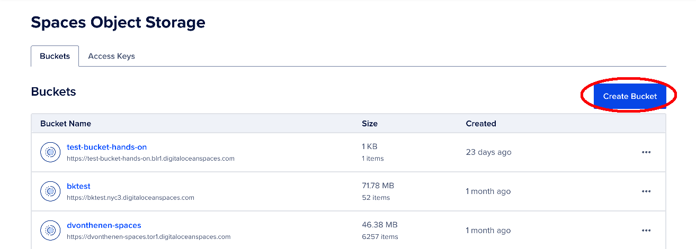
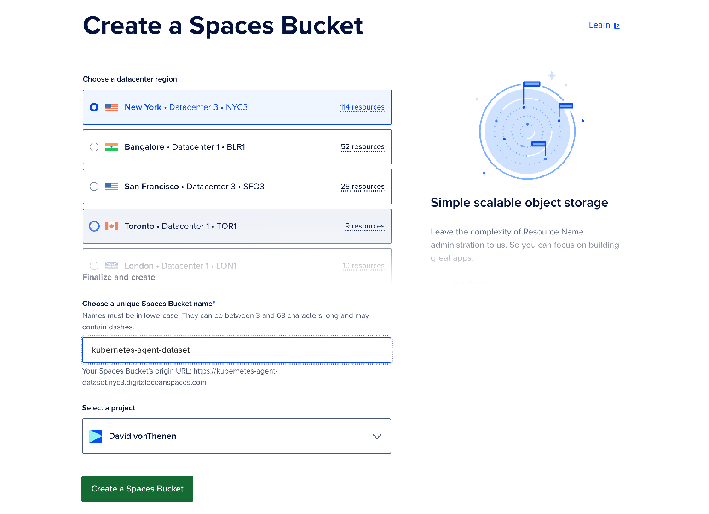
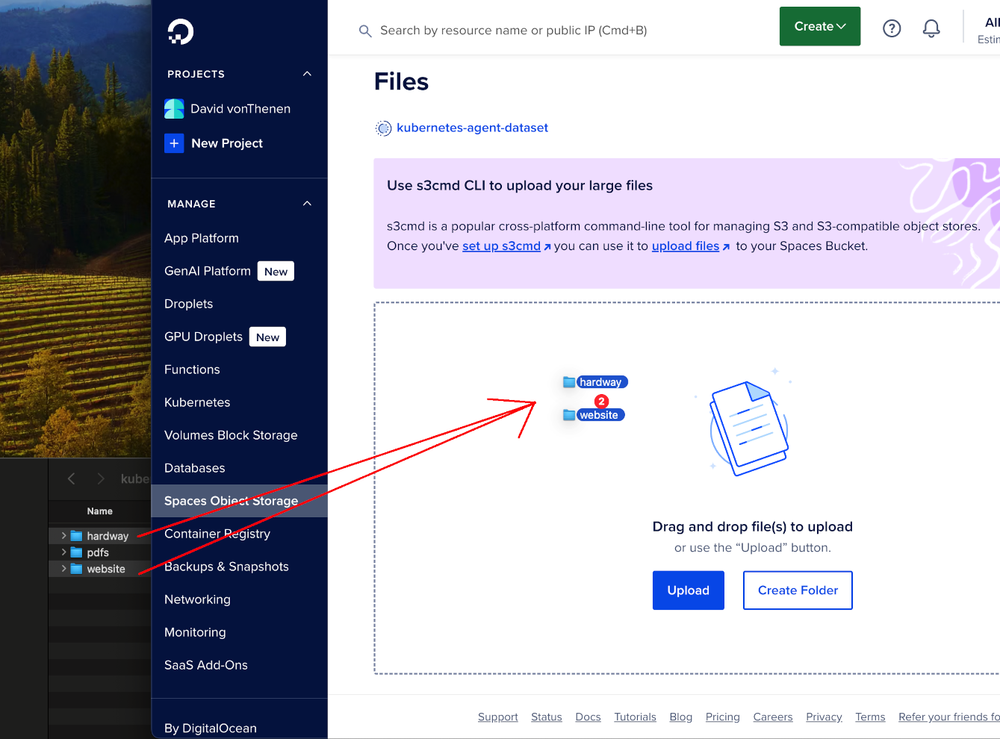
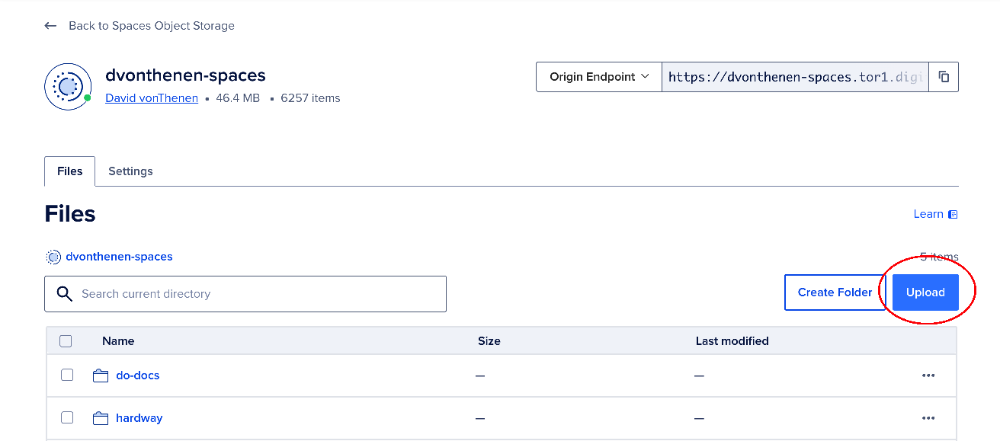

# Step 1: Creating Your Dataset on DigitalOcean Spaces

This guide will walk you through creating a DigitalOcean Spaces object store to host the dataset for the Kubernetes AI Agent, extracting the dataset contents, and uploading the prepared data.

## 1.1 Create a Spaces Object Store

To begin, you'll need to create a DigitalOcean Spaces object store where the dataset will be stored. Follow these steps:

1. Log in to your DigitalOcean account.
2. Navigate to the [Spaces creation page](https://cloud.digitalocean.com/spaces).

   

3. Click **Create Bucket** and configure the following:
   - Select a datacenter region closest to your target audience.
   - Choose a unique name for your Space (e.g., `<your name>-kubernetes-agent-dataset`).
     - **NOTE:** Spaces buckets have unique names since they can be exposed the public internet if desired. Include your name to make the bucket name unique.
   - Leave the default settings for permissions unless you require public access.

   

4. Once the Space is created, note the endpoint URL for later use.

For more details, refer to the [Spaces Quickstart Guide](https://docs.digitalocean.com/products/spaces/getting-started/quickstart/).

## 1.2 Extract the Dataset Contents

The dataset for the Kubernetes AI Agent is available in the GitHub repository. Extract the contents of the dataset archive as follows:

1. If you haven't done this already, clone the workshop repository:

   ```bash
   git clone https://github.com/do-community/genai-agent-workshop.git
   ```

2. Navigate to the dataset folder:

   ```bash
   cd genai-agent-workshop/kubernetes-walkthrough
   ```

3. Extract the contents of the ZIP file:

   ```bash
   unzip kubernetes-agent.zip -d kubernetes-agent-dataset
   ```

### (Optional) More Details on the Dataset Creation

This note shows how we prepared the dataset in step 1.2 above. There is no need to do this if you are using the `genai-agent-workshop/kubernetes-walkthrough` zip file. This is just for your information.

This dataset was prepared by combining files from the following repositories:

- [Kubernetes the Hard Way](https://github.com/kelseyhightower/kubernetes-the-hard-way)
- [Kubernetes Website](https://github.com/kubernetes/website)

From these repositories, only the markdown (`.md`) files were retained. Below is an example of how this process was carried out:

```bash
# Clone the required repositories
git clone https://github.com/kelseyhightower/kubernetes-the-hard-way.git
git clone https://github.com/kubernetes/website.git

# Retain only markdown files and delete other contents
cd kubernetes-agent
find ./hardway -type f ! -name "*.md" -delete
find ./website -type f ! -name "*.md" -delete

# Delete empty folders
find ./hardway -type d -empty -delete
find ./website -type d -empty -delete
```

## 1.3 Upload the Dataset to the Spaces Object Store

We need to upload the dataset to the spaces bucket. There are two methods for doing this...

### (Recommended) Easy Method



Navigate to your `<your name>-kubernetes-agent-dataset` folder, then drag and drop the following folders in your spaces bucket (this will create folders and upload the files):

1. website
2. hardway

Verify the folders have been uploaded and then move onto the next section.

### (Not Recommended) The Hard Method

Using the `Create` button, create 2 folders in your buckets:

1. website
2. hardway

For each of the folders your create, click the upload button and upload the contents of the two folders within the dataset.



Your dataset is now ready to be accessed by the Kubernetes AI Agent! Verify the folders have been uploaded and then move onto the next section.

## Next Steps...

→ [Next Up: Creating Your Knowledge base on DigitalOcean Spaces](./STEP2_KNOWLEDGE_BASE.md) 
