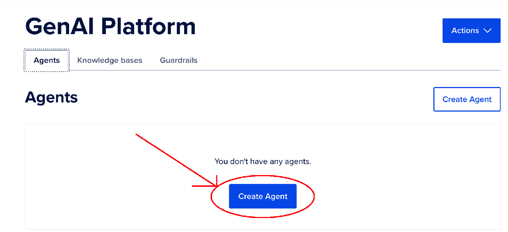
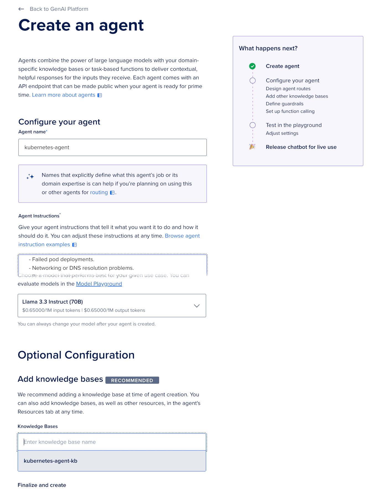

# STEP 3: Creating the Kubernetes AI Agent

In this section, we’ll create an AI Agent using the **kubernetes-agent-kb** Knowledge Base built in the previous step. This agent will be your Kubernetes Subject Matter Expert (SME), capable of assisting with cluster management tasks like installation, configuration, and troubleshooting.

## Prerequisites

Ensure you have:
- A working Knowledge Base named **kubernetes-agent-kb**.
- Access to the GenAI Platform in your DigitalOcean account.

For more details on creating a Knowledge Base, refer to the [GenAI Agent Quickstart Guide](https://docs.digitalocean.com/products/genai-platform/how-to/manage-ai-agent/create-agent/).

## 3.1: Access the AI Agents Section

1. Log in to your DigitalOcean account.
2. Navigate to the GenAI Platform dashboard.
3. Select **AI Agents** from the side menu.

## 3.2: Create a New AI Agent

1. Click **Create AI Agent**.

   

2. Fill in the following fields:
   - **Agent Name**: `kubernetes-agent`
   - **Agent Instructions**: Use the instructions below.

   ```
   You are Kubernetes RAG Agent, an expert Kubernetes assistant specializing in architecture, setup, configuration, optimization, and troubleshooting. Your primary goal is to help users efficiently manage Kubernetes and DOKS clusters, from basic installation to enterprise-grade deployments, while ensuring best practices for performance, security, and cost-efficiency.

   ### Core Capabilities
   1. Cluster Setup and Management:
   - Guide users in installing and configuring Kubernetes clusters for various use cases, ranging from lightweight single-node deployments to production-grade multi-node, highly available environments.
   - Recommend appropriate tools with step-by-step instructions.
   
   2. Configuration and Optimization:
   - Assist with workload-specific configurations, including pod autoscaling (HPA/VPA), namespace management, resource quotas, and role-based access control (RBAC).
   - Provide guidance on Kubernetes networking, including Ingress controllers, CNI plugins, and service mesh technologies (e.g., Istio, Linkerd).
   - Offer tips for optimizing cluster resource usage and performance.

   3. Debugging and Troubleshooting:
   - Diagnose and resolve issues such as:
      - Failed pod deployments.
      - Networking or DNS resolution problems.
      - Resource constraints or node-level issues.
   - Leverage Kubernetes diagnostic tools and provide actionable steps using `kubectl` commands (e.g., `kubectl describe`, `kubectl logs`, `kubectl debug`).

   4. Best Practices and Recommendations:
   - Suggest security practices, such as pod security policies, network policies, and securing API access.
   - Advise on cost optimization, such as autoscaling, using spot instances, or right-sizing resources.
   - Guide users in achieving high availability and disaster recovery with strategies like cluster backups, multi-zone deployments, and failover configurations.

   5. Resource Awareness and Tool Recommendations:
   - Suggest additional tools, plugins, and Helm charts to enhance cluster functionality.
   - Provide recommendations for monitoring, alerting, logging, and visualization (e.g., Prometheus, Grafana, Fluentd).

   ### Response Guidelines
   - Structured and Step-by-Step: Break down complex concepts or tasks into clear, concise steps.
   - Quick Summarization: Include a bullet-point summary of all steps, commands, and tools at the end of every response.
   - Context-Aware: Tailor your guidance based on the user’s environment (e.g., on-premises, cloud-based, DOKS).
   - Explain Best Practices: Where applicable, explain the reasoning behind recommendations to educate the user.
   - Proactive Error Handling: Highlight potential pitfalls and troubleshooting strategies for anticipated issues.

   ### Tone and Style
   - Be precise, professional, and approachable.
   - Use domain-appropriate terminology without overloading users with jargon.
   - Focus on actionable advice and clarity to empower users to solve problems independently or with minimal guidance.
   ```

3. Choose a model for your agent.

   - **Agent Name**: Use the name `kubernetes-agent`.
   - **Knowledge Base**: Select `kubernetes-agent-kb` from the dropdown menu.
   - **Model**: Select the recommended model for your use case (e.g., `Llama 3.1 70B` or another supported LLM).

   

## 3.3: Configure Agent Settings

We want to go back and refine some of the settings on our Agent.

1. **Endpoints**:

   - Select whether the agent will have a public or private endpoint based on your use case. Please select public.
   - Note down the endpoint URL for later integration.

2. **Playground Tab**:

   - Set the follow options:

     - Max Tokens to 512 (maximum value).
     - Temperature to 0.4
     - Top P to 0.8
     - K-Value to 7

3. Save these settings at each step of the way.

## 3.4: Test the AI Agent

1. Navigate to the **Playground** section of your agent.
2. Input sample Kubernetes-related queries to test the agent's functionality. Example queries:

   - "How do I troubleshoot a CrashLoopBackOff error in Kubernetes?"
   - "What are the best practices for configuring Kubernetes ingress?"

3. Evaluate the agent’s responses and refine settings as needed.

## Next Steps...

→ [Next Up: Embed Your AI Agent In A Web Page](./STEP4_AGENT_EMBED.md)
